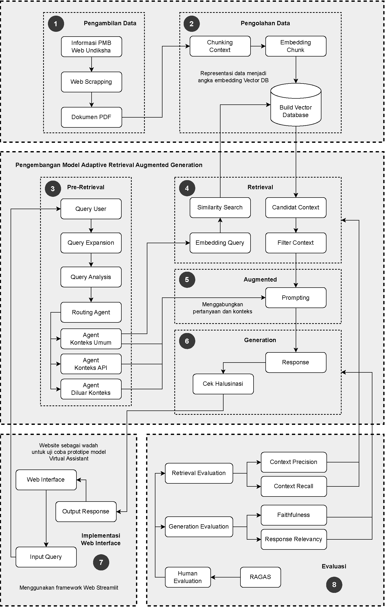
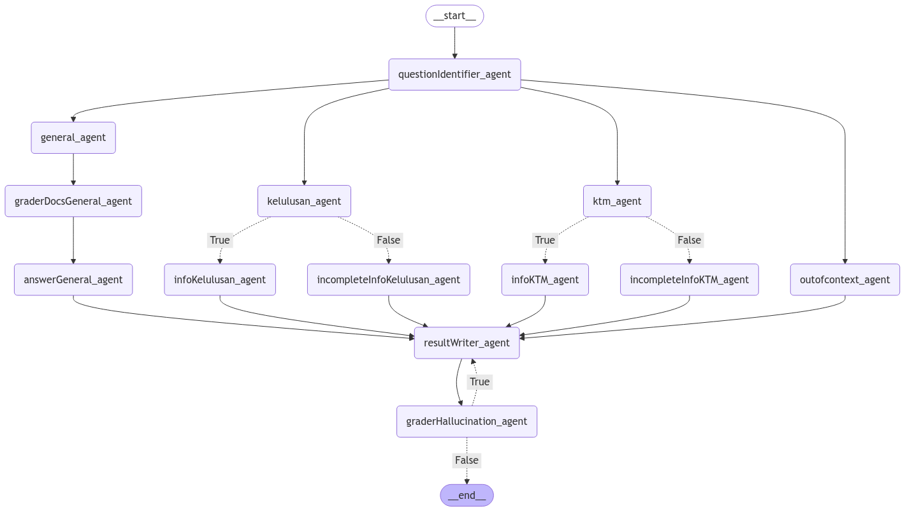

# VIRTUAL ASSISTANT PMB UNDIKSHA

## Ringkasan

Virtual Assistant Penerimaan Mahasiswa Baru Universitas Pendidikan Ganesha adalah sebuah layanan inovatif yang dirancang untuk mempermudah calon mahasiswa dalam mengakses informasi terkait proses penerimaan mahasiswa baru, mengecek kelulusan jalur mandiri, dan mencetak Kartu Tanda Mahasiswa. Virtual Assistant ini dikembangkan dengan berbasis Multi-Agent LLM yang menggunakan Teknik Adaptive-RAG pada Sistem Penerimaan Mahasiswa Baru (PMB) di Universitas Pendidikan Ganesha (Undiksha). Menggunakan OpenAI sebagai LLM, LangChain untuk proses RAG, Langgraph untuk mengelola Multi-Agent LLM Adaptive-RAG, dan FAISS sebagai vector database. Virtual Assistant ini dirancang untuk memberikan informasi yang akurat dan cepat, meningkatkan efisiensi dan pengalaman pengguna dalam proses penerimaan mahasiswa.



## Permasalahan

Di periode-periode sebelumnya, pada Sistem Informasi PMB Undiksha masih mengandalkan penyebaran informasi secara manual melalui website atau grup sosial media seperti Telegram, yang mengharuskan pengguna untuk secara aktif mencari informasi. Pendekatan ini memiliki beberapa kelemahan, yaitu:

- Tidak efisien dan memakan waktu lebih lama.
- Memerlukan interaksi langsung dengan admin atau sistem yang tidak fleksibel.
- Seringkali calon mahasiswa mengulang pertanyaan yang sebenarnya sudah terjawab.
  Hal ini membuat pengalaman pengguna kurang optimal dan menyulitkan dalam menghadapi volume pertanyaan yang terus berkembang.

## Solusi

Virtual Assistant PMB Undiksha menawarkan solusi dengan teknologi terkini untuk mengatasi permasalahan di atas. Dengan memanfaatkan Retrieval Augmented Generation (RAG), Virtual Assistant ini dapat:

- Meningkatkan efisiensi dengan jawaban relevan dan akurat dari database dengan instan tanpa menunggu balasan langsung dari admin.
- Menjawab pertanyaan sering diajukan dengan cepat dan konsisten.
- Memungkinkan pembaruan informasi mudah dan responsif terhadap kebutuhan terbaru.

## Teknologi

- [Python](https://www.python.org/): Bahasa pemrograman untuk membuat Virtual Assistant.
- [Langchain](https://www.langchain.com/): Framework untuk mengelola alur kerja RAG.
- [Langgraph](https://www.langchain.com/langgraph): Framework untuk Multi-Agent LLM pada Langchain.
- [OpenAI](https://openai.com/): Embedding dan model RAG berbayar.
- [FAISS](https://faiss.ai/): Penyimpanan vector database.
- [FastAPI](https://fastapi.tiangolo.com/): Framework untuk membuat endpoint API.
- [Streamlit](https://streamlit.io/): Framework web interface application.

## Apa itu RAG?


Retrieval-Augmented Generation (RAG) adalah teknik yang dirancang untuk meningkatkan kinerja Large Language Model (LLM) dengan mengakses informasi dari sumber eksternal. Dengan RAG, Virtual Assistant dapat memberikan jawaban yang lebih akurat dan relevan, serta mengurangi kemungkinan halusinasi terhadap suatu informasi.

## Alur Kerja RAG

#### 1. Retrieve (Kumpulkan):

- Kueri dari pengguna digunakan untuk mencari konteks relevan dari sumber pengetahuan eksternal.
- Kuery diubah menjadi vektor dan dicocokkan dengan vektor dalam database (sumber pengetahuan juga telah melewati fase ini), sehingga mendapatkan objek data relevan (k untuk objek paling relevan).

#### 2. Augment (Tambahkan):

- Konteks diambil dan digabungkan dengan kueri pengguna menggunakan template prompt.

#### 3. Generate (Hasilkan Respon):

- Prompt yang sudah dimodifikasi struktur datanya dimasukkan ke dalam LLM untuk menghasilkan respons akhir.

## Contoh Implementasi


Pertanyaan Pengguna (Kueri) "Apa syarat untuk mendaftar sebagai mahasiswa baru di Undiksha?"

#### 1. Retrieve

Konteks relevan diambil dari database vektor.
Konteks: "Untuk mendaftar sebagai mahasiswa baru di Undiksha, calon mahasiswa harus memiliki ijazah SMA atau sederajat, melengkapi formulir pendaftaran, dan mengikuti ujian masuk."

#### 2. Augment

Gabungkan kuery pengguna dengan konteks yang diambil menggunakan template prompt.
Prompt: Pertanyaan: {question} dan Konteks: {context}"

#### 3. Generate

LLM memproses prompt tersebut untuk menghasilkan respons lengkap.
Respons Akhir: "Syarat-syarat pendaftaran mahasiswa baru di Undiksha adalah sebagai berikut: Untuk mendaftar sebagai mahasiswa baru di Undiksha, calon mahasiswa harus memiliki ijazah SMA atau sederajat, melengkapi formulir pendaftaran, dan mengikuti ujian masuk."

## Instalasi Project

Clone project

```bash
  https://github.com/odetv/va-pmb-undiksha.git
```

Masuk ke direktori project

```bash
  cd va-pmb-undiksha
```

Buat virtual environment

```bash
  pip install virtualenv
  python -m venv venv
  venv/Scripts/activate     # windows
  source venv/bin/activate  # macOS atau linux
```

Install requirements

```bash
  pip install -r requirements.txt
```

Buat dan Lengkapi file environment variabel (.env)

```bash
  OPENAI_API_KEY="YOUR_OPENAI_API_KEY"
  OLLAMA_BASE_URL="YOUR_OLLAMA_BASE_URL"
  API_KTM_UNDIKSHA_AUTH_URL="AUTH_URL_API_KTM_UNDIKSHA"
  API_KTM_UNDIKSHA_USERNAME="USERNAME_API_KTM_UNDIKSHA"
  API_KTM_UNDIKSHA_PASSWORD="PASSWORD_API_KTM_UNDIKSHA"
  API_KTM_UNDIKSHA_RESPONSE_URL="RESPONSE_URL_API_KTM_UNDIKSHA"
  API_KELULUSAN_UNDIKSHA_AUTH_URL="AUTH_URL_API_KELULUSAN_UNDIKSHA"
  API_KELULUSAN_UNDIKSHA_USERNAME="USERNAME_API_KELULUSAN_UNDIKSHA"
  API_KELULUSAN_UNDIKSHA_PASSWORD="PASSWORD_API_KELULUSAN_UNDIKSHA"
  API_KELULUSAN_UNDIKSHA_RESPONSE_URL="RESPONSE_URL_API_KELULUSAN_UNDIKSHA"
  STREAMLIT_KEY_ADMIN="ADMIN_KEY_TO_ACCESS_DEBUG_STREAMLIT"
  VA_BEARER_TOKEN="TOKEN_FOR_BUILD_API_VIRTUAL_ASSISTANT"
  VA_LLM_SERVICE="OPENAI_OR_OLLAMA"
  VA_EMBEDDER_SERVICE="OPENAI_OR_OLLAMA"
```

Jalankan dengan Web Streamlit (Frontpage: `/chat` dan Backpage: `/configuration`)

```bash
  streamlit run app/chat.py --server.port XXXX
```

Atau

Jalankan dengan API (Dokumentasi: `/docs` atau `/openapipmb.json`)

```bash
  uvicorn api.api:app --host 0.0.0.0 --port XXXX --workers X
```

Atau

Jalankan dengan CLI di Terminal

```bash
  # Tambahkan baris kode ini pada baris terakhir file main.py:
  rag_adaptive("Ketik pertanyaan disini")

  # Jalankan di terminal:
  python main.py
```

Contoh pertanyaan dapat dilihat disini: [example_question.txt](public/etc/example_question.txt)

## Struktur Project

```
va-pmb-undiksha                         # Root directory project
├─ api                                  # API model service
│  ├─ logs
│  │  ├─ logs_activity.xlsx
│  │  └─ logs_configllm.xlsx
│  └─ api.py                            # Base code run API service
├─ app                                  # Web interface streamlit
│  ├─ .streamlit
│  │  └─ config.toml
│  ├─ pages
│  │  └─ configuration.py               # Configuration page in web streamlit
│  └─ chat.py                           # Base code run web streamlit
├─ public                               # Public assets file and media
│  ├─ etc
│  │  └─ example_question.txt
│  └─ images
│     └─ any-images.jpg
├─ src                                  # Source base directory
│  ├─ agents
│  │  ├─ general_agent
│  │  │  └─ any-agent.py
│  │  ├─ kelulusan_agent
│  │  │  └─ any-agent.py
│  │  ├─ ktm_agent
│  │  │  └─ any-agent.py
│  │  ├─ outofcontext_agent
│  │  │  └─ any-agent.py
│  │  ├─ grader_hallucination_agent.py
│  │  ├─ question_identifier_agent.py
│  │  └─ result_writer_agent.py
│  ├─ config
│  │  └─ config.py
│  ├─ datasets
│  │  └─ any-datasets.pdf
│  ├─ graph
│  │  └─ graph-va-pmb-undiksha.png
│  └─ vectordb
│     ├─ index.faiss
│     └─ index.pkl
├─ test                                 # Unit test evaluation RAGAS
│  ├─ config
│  │  ├─ list_qa.xlsx
│  │  ├─ rag_adaptive.py
│  │  ├─ rag_naive.py
│  │  └─ sample_case.py
│  ├─ scores_ragas
│  │  ├─ final
│  │  │  ├─ score_test_adaptive.xlsx
│  │  │  └─ score_test_naive.xlsx
│  │  ├─ score_test_adaptive.xlsx
│  │  └─ score_test_naive.xlsx
│  ├─ test_adaptive.py
│  └─ test_naive.py
├─ utils                                # Tools reusable
│  ├─ agent_state.py
│  ├─ api_undiksha.py
│  ├─ create_graph_image.py
│  ├─ debug_time.py
│  ├─ expansion.py
│  ├─ llm.py
│  ├─ logging.py
│  ├─ raw_process.py
│  ├─ scrapper_datasets.py
│  └─ scrapper_rss.py
├─ .dockerignore
├─ .env.example                         # Environment example for use
├─ .gitignore
├─ docker-compose.yaml
├─ Dockerfile
├─ main.py                              # Parrent code virtual assistant
├─ README.md
└─ requirements.txt                     # Packages dependencies project
```

## Referensi

1. [Build a ChatBot Using Local LLM](https://datasciencenerd.us/build-a-chatbot-using-local-llm-6b8dbb0ca514)
2. [Best Practices in Retrieval Augmented Generation](https://gradientflow.substack.com/p/best-practices-in-retrieval-augmented)
3. [Simplest Method to improve RAG pipeline: Re-Ranking](https://medium.com/etoai/simplest-method-to-improve-rag-pipeline-re-ranking-cf6eaec6d544)
4. [The What and How of RAG(Retrieval Augmented Generation) Implementation Using Langchain](https://srinivas-mahakud.medium.com/the-what-and-how-of-retrieval-augmented-generation-8e4a05c08a50)
5. [Retrieval-Augmented Generation (RAG): From Theory to LangChain Implementation](https://towardsdatascience.com/retrieval-augmented-generation-rag-from-theory-to-langchain-implementation-4e9bd5f6a4f2)
6. [RAG - PDF Q&A Using Llama 2 in 8 Steps](https://medium.com/@Sanjjushri/rag-pdf-q-a-using-llama-2-in-8-steps-021a7dbe26e1)
7. [RAG + Langchain Python Project: Easy AI/Chat For Your Docs](https://youtu.be/tcqEUSNCn8I)
8. [Python RAG Tutorial (with Local LLMs): Al For Your PDFs](https://youtu.be/2TJxpyO3ei4)
9. [A Survey of Techniques for Maximizing LLM Performance](https://youtu.be/ahnGLM-RC1Y)
10. [18 Lessons teaching everything you need to know to start building Generative AI applications](https://microsoft.github.io/generative-ai-for-beginners/#/)
11. [How to build a PDF chatbot with Langchain 🦜🔗 and FAISS](https://kevincoder.co.za/how-to-build-a-pdf-chatbot-with-langchain-and-faiss)
12. [How to Enhance Conversational Agents with Memory in Lang Chain](https://heartbeat.comet.ml/how-to-enhance-conversational-agents-with-memory-in-lang-chain-6aadd335b621)
13. [Memory in LLMChain](https://python.langchain.com/v0.1/docs/modules/memory/adding_memory/)
14. [RunnableWithMessageHistory](https://api.python.langchain.com/en/latest/runnables/langchain_core.runnables.history.RunnableWithMessageHistory.html#langchain_core.runnables.history.RunnableWithMessageHistory)
15. [Why Assistants API is Slow? Any speed solution?](https://community.openai.com/t/why-assistants-api-is-slow-any-speed-solution/558065)
16. [OpenAI API is extremely slow](https://github.com/langchain-ai/langchain/issues/11836)
17. [Adaptive RAG](https://langchain-ai.github.io/langgraph/tutorials/rag/langgraph_adaptive_rag/)
18. [Hands-On LangChain for LLMs App: ChatBots Memory](https://pub.towardsai.net/hands-on-langchain-for-llms-app-chatbots-memory-9394030e5a9e)
19. [How to Make LLM Remember Conversation with Langchain](https://medium.com/@vinayakdeshpande111/how-to-make-llm-remember-conversation-with-langchain-924083079d95)
20. [Conversation Summary Buffer](https://python.langchain.com/v0.1/docs/modules/memory/types/summary_buffer/)
21. [From Basics to Advanced: Exploring LangGraph](https://towardsdatascience.com/from-basics-to-advanced-exploring-langgraph-e8c1cf4db787)
22. [Build a Reliable RAG Agent using LangGraph](https://medium.com/the-ai-forum/build-a-reliable-rag-agent-using-langgraph-2694d55995cd)
23. [LangGraph](https://langchain-ai.github.io/langgraph/)
24. [Steps In Evaluating Retrieval Augmented Generation (RAG) Pipelines](https://cobusgreyling.medium.com/steps-in-evaluating-retrieval-augmented-generation-rag-pipelines-7d4b393e62b3)
25. [RAG Evaluation](https://cobusgreyling.medium.com/rag-evaluation-9813a931b3d4)
26. [Evaluating RAG Applications with RAGAs](https://towardsdatascience.com/evaluating-rag-applications-with-ragas-81d67b0ee31a)
27. [RAGAS for RAG in LLMs: A Comprehensive Guide to Evaluation Metrics](https://dkaarthick.medium.com/ragas-for-rag-in-llms-a-comprehensive-guide-to-evaluation-metrics-3aca142d6e38)
28. [Advanced RAG Techniques: What They Are & How to Use Them](https://www.falkordb.com/blog/advanced-rag/)
29. [Visualize your RAG Data - Evaluate your Retrieval-Augmented Generation System with Ragas](https://towardsdatascience.com/visualize-your-rag-data-evaluate-your-retrieval-augmented-generation-system-with-ragas-fc2486308557/)
30. [Visualize your RAG Data — EDA for Retrieval-Augmented Generation](https://itnext.io/visualize-your-rag-data-eda-for-retrieval-augmented-generation-0701ee98768f)
